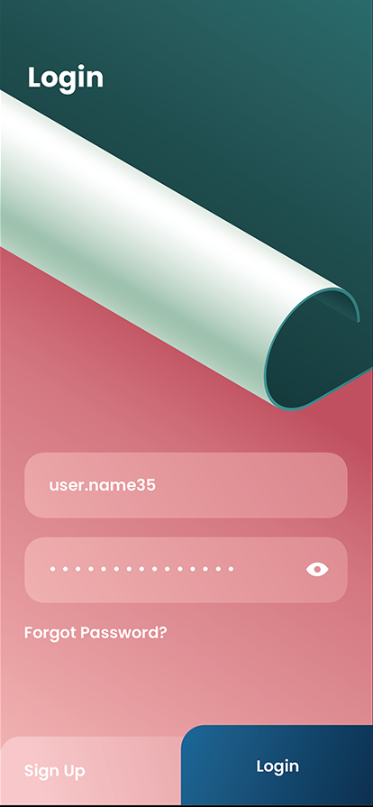

Group #1 SWIFTAF - README 
===

# Plasticity

## Table of Contents
1. [Overview](#Overview)
1. [Product Spec](#Product-Spec)
1. [Wireframes](#Wireframes)
2. [Schema](#Schema)

## Overview
### Description
iOS app that will serve to offer users multiple exercises intended to challenge finger dexterity and mental agility. There will be two games that a user
can select to play, a physical and mental game.  

### App Evaluation
[Evaluation of your app across the following attributes]
- **Category: Gaming**
- **Mobile: This app would primarily be developed for mobile devices.**
- **Story: The target audience is stroke survivors with physical and cognitive deficits.**
- **Market: Any individual can use this app but targeted to stroke survivors**
- **Habit: This app can be used whenever the user would like to use and play with**
- **Scope: There will be different levels that users can play with and depending on the performance the levels get challenging.**

## Product Spec

### 1. User Stories (Required and Optional)

**Required Must-have Stories**

* See the application logo 
* Be able to create an account 
* Be able to sign in 
* Be able to log out 
* Have a navigation bar to see which scenes to click on 
* See a home page screen that consists of the features 
* 2048 game: Practice motion skills 
* Wordle game: Practice cognitive skills 
* Be able to see victory when user wins game 
* Be able to see loss when user loses game 
* Scoreboard tracker 

**Optional Nice-to-have Stories**

* To do list to keep track of daily tasks

### 2. Screen Archetypes

* Login
* Create an account- user can sign in or sign up to 
* Profile screen
* 2048 game screen
* World game screen
* History/stats screen
  

### 3. Navigation

**Tab Navigation** (Tab to Screen)

* Profile
* History, stats
* Home page return

**Flow Navigation** (Screen to Screen)

* Launch Screen
* Home Page
* Navigation bar
* Select games
  -2048
  -Wordle

## Wireframes
[Add picture of your hand sketched wireframes in this section]

### [BONUS] Digital Wireframes & Mockups

### [BONUS] Interactive Prototype

## Schema 
[This section will be completed in Unit 9]
### Models
[Add table of models]
### Networking
- [Add list of network requests by screen ]
- [Create basic snippets for each Parse network request]
- [OPTIONAL: List endpoints if using existing API such as Yelp]
