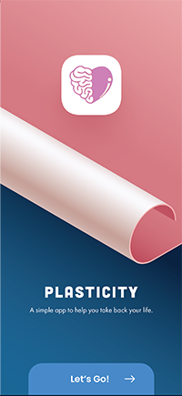
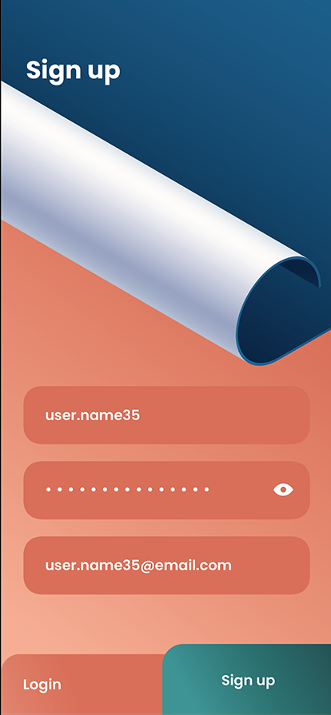
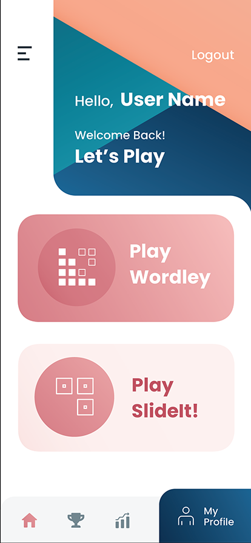
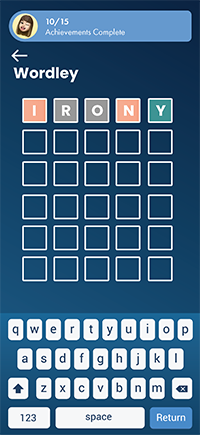
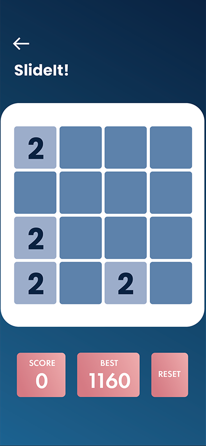
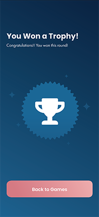
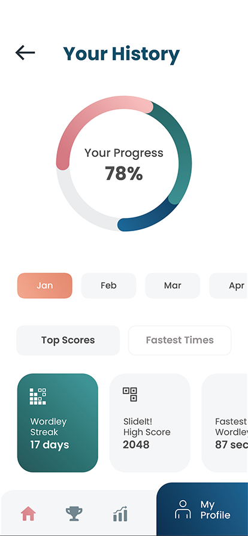
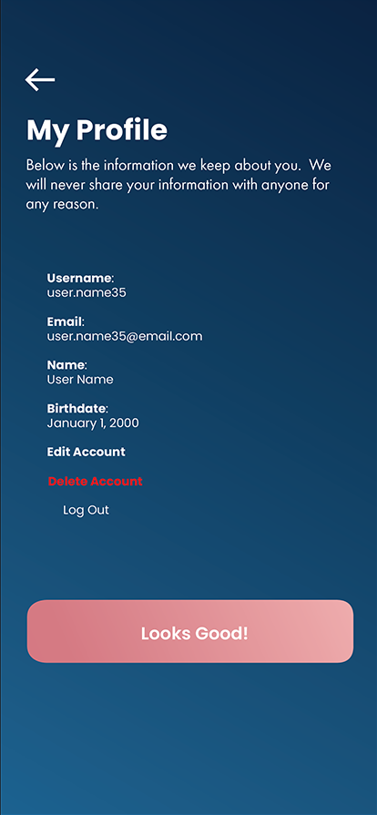

Group #1 SWIFTAF - README 
===

# Plasticity

## Table of Contents
1. [Overview](#Overview)
1. [Product Spec](#Product-Spec)
1. [Wireframes](#Wireframes)
2. [Schema](#Schema)

## Overview
### Description
iOS app that will serve to offer users multiple exercises intended to challenge finger dexterity and mental agility. There will be two games that a user
can select to play, a physical and mental game.  

### App Evaluation
[Evaluation of your app across the following attributes]
- **Category: Gaming**
- **Mobile: This app would primarily be developed for mobile devices.**
- **Story: The target audience is stroke survivors with physical and cognitive deficits.**
- **Market: Any individual can use this app but targeted to stroke survivors**
- **Habit: This app can be used whenever the user would like to use and play with**
- **Scope: There will be different levels that users can play with and depending on the performance the levels get challenging.**

## Product Spec

### 1. User Stories (Required and Optional)

**Required Must-have Stories**

- See the application logo 
- Be able to create an account 
- Be able to sign in 
- Be able to log out 
- Have a navigation bar to see which scenes to click on 
- See a home page screen that consists of the features 
- SlideIt game: Practice motion skills 
- Wordley game: Practice cognitive skills 
- Be able to see victory when user wins game 
- Be able to see loss when user loses game 
- Scoreboard tracker 


**Optional Nice-to-have Stories**

- To do list to keep track of daily tasks

### 2. Screen Archetypes

- Launch Screen
- Registration
- Login
- Home Screen
- Wordley Game Screen
- SlideIt Game Screen
- Trophy Screen
- History/Stats Screen
- Profile Screen


### 3. Navigation

**Tab Navigation*- (Tab to Screen)

- Profile
- History, stats
- Home screen return

**Flow Navigation*- (Screen to Screen)

- Launch Screen
- Home Screen
- Navigation bar
- Select games (Wordley/SlideIt)


## Wireframes

        

## Schema 
### Models


| Property | Type    | Description                           | 
| ---------|-------  | ------------------------------------- |
| username | String  | identification for user to login with |
| password | String  | secret data for user to access login  |
| profile  | String  | user's info                           |
| score    | Number  | number of points user recieves        |
| best     | Number  | number of high score user recieves    |
| reset    | String  | used to restart the game              |


### Networking

- Signup Screen
  - (Create/POST) Signup with Username, Password, and Email
  ```swift
  let user = PFUser()
  user.username = usernameField.text
  user.password = passwordField.text
  user.email = emailField.text
  user.signUpInBackground { (success, error) in
      if success {
          self.performSegue(withIdentifier: "loginSegue", sender: nil)
      } else {
          print("Error: \(error?.localizedDescription)")
      }
  }
  ```

- Login Screen
  - (Create/POST) Login with Username & Password
  ```swift
  let username = usernameField.text!
  let password = passwordField.text!
  PFUser.logInWithUsername(inBackground: username, password: password) { (user, error) in
      if user != nil {
          self.performSegue(withIdentifier: "loginSegue", sender: nil)
      } else {
          print("Error: \(error?.localizedDescription)")
      }
  }
  ```

- Main Screen
  - (Read/GET) Get Current Username
  ```swift
  let currentUser = PFUser.currentUser()
  if currentUser != nil {
  // Do stuff with the user
  } else {
  // Show the signup or login screen
  }
  ```

- Profile screen
  - (Read/GET) Get Current User Pnformation
      ```swift
      var query = PFQuery(className:"User")

      query.getObjectInBackgroundWithId("<PARSE_OBJECT_ID>") {
      (parseObject: PFObject?, error: NSError?) -> Void in
      if error == nil && parseObject != nil {
          print(parseObject)
      } else {
          print(error)
      }
      }
      ```
- [OPTIONAL: List endpoints if using existing API such as Yelp]
