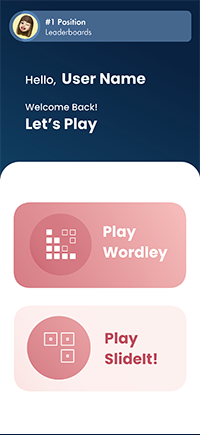
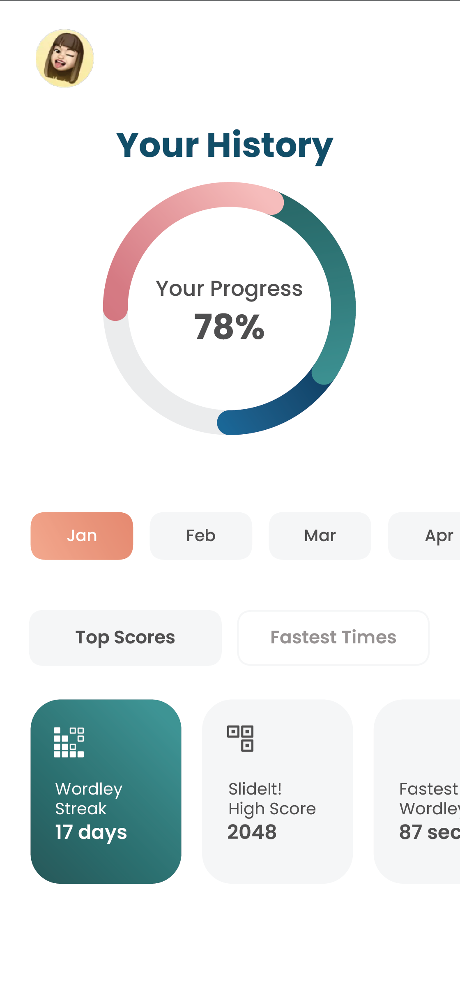

Group #1 SWIFTAF - README 
===

# Plasticiti

## Plasticiti Sprint 2

### User Stories

#### REQUIRED
- [x] User sees the 5x6 game board.
- [x] User sees the keyboard.
- [x] User can use the keyboard.
- [x] User sees the color orange highlighted when letter is not in correct position.
- [x] User sees the color green highlighted when letter is in correct position.


### App Walkthrough GIF


## Plasticiti Sprint 1

### User Stories

#### REQUIRED
- [x] User sees an app icon on the home screen.
- [x] User sees a styled launch screen.
- [x] User can sign into Game Center
- [x] User can sign out of Game Center.


### App Walkthrough GIF


## Table of Contents
1. [Overview](#Overview)
1. [Product Spec](#Product-Spec)
1. [Wireframes](#Wireframes)
2. [Schema](#Schema)

## Overview
### Description
iOS app that will serve to offer users multiple exercises intended to challenge finger dexterity and mental agility. There will be two games that a user
can select to play, a physical and mental game.  

### App Evaluation
[Evaluation of your app across the following attributes]
- **Category: Gaming**
- **Mobile: This app would primarily be developed for mobile devices.**
- **Story: The target audience is stroke survivors with physical and cognitive deficits.**
- **Market: Any individual can use this app but targeted to stroke survivors**
- **Habit: This app can be used whenever the user would like to use and play with**
- **Scope: There will be different levels that users can play with and depending on the performance the levels get challenging.**

## Product Spec

### 1. User Stories (Required and Optional)

**Required Must-have Stories**

- See the application logo 
- Be able to sign into Game Center if not already signed in
- See a home page screen that consists of the features 
- SlideIt game: Practice motion skills 
- Wordley game: Practice cognitive skills 
- Be able to see victory when user wins game 
- Be able to see loss when user loses game 
- Scoreboard tracker 


**Optional Nice-to-have Stories**

- To do list to keep track of daily tasks

### 2. Screen Archetypes

- Launch Screen
- Game Center Login
- Home Screen
- Wordley Game Screen
- SlideIt Game Screen
- Trophy Screen
- History/Stats Screen


### 3. Navigation

**Tab Navigation*- (Tab to Screen)

- Profile
- History, stats
- Home screen return

**Flow Navigation*- (Screen to Screen)

- Launch Screen
- Home Screen
- Select games (Wordley/SlideIt)


## Wireframes

       

## Schema 
### Models

#### POST

| Property      | Type    | Description                             | 
|---------------|---------|-----------------------------------------|
| name          | String  | User's AppleID username                 |
| score         | Int     | Number of points user receives          |
| reset         | Boolean | Used to restart the game                |

#### GET

| Property      | Type    | Description                             | 
|---------------|---------|-----------------------------------------|
| GKLocalPlayer | Object  | User's Game Center profile              |
| best          | Int     | Highest score returned from Game Center |
| achievement   | Int     | Achievement set in Game Center          |


### Networking

- Login Screen
  - (Create/POST) Login to Game Center
```swift
GKLocalPlayer.local.authenticateHandler = { viewController, error in
  NotificationCenter.default.post(name: .authenticationChanged, object: GKLocalPlayer.local.isAuthenticated)
  if GKLocalPlayer.local.isAuthenticated {
    // user authenticated - enable gamecenter
    GKLocalPlayer.local.register(self)
  } else {
    // user not authenticated - disable game center
  }
}


  ```

- Main Screen
  - (Read/GET) Get Current Username
```swift
let localPlayer = GKLocalPlayer()
if localPlayer != nil {
// Do stuff with the user
} else {
// Show the signup or login screen
}
```
- Wordle Game screen
  - (Create/POST) If achievement made
```swift
// initiate score instance in leaderboard
GKScore *gScore = [[GKScore alloc]
    initWithLeaderboardIdentifier:LEADERBOARD_ID];
gScore.value = score;

// if score is reaches achievement level, add achievement
if(score >= achievement) {
    GKAchievement *noviceAchievement =
        [[GKAchievement alloc]
        initWithIdentifier:ACHIEVEMENT_NOVICE_ID];
    noviceAchievement.percentComplete = 100;
    [achievements addObject:noviceAchievement];
}
```

- SlideIt Game screen
  - (Create/POST) If achievement made
```swift
// initiate score instance in leaderboard
GKScore *gScore = [[GKScore alloc]
    initWithLeaderboardIdentifier:LEADERBOARD_ID];
gScore.value = score;

// if score is reaches achievement level, add achievement
if(score >= achievement) {
    GKAchievement *noviceAchievement =
        [[GKAchievement alloc]
        initWithIdentifier:ACHIEVEMENT_NOVICE_ID];
    noviceAchievement.percentComplete = 100;
    [achievements addObject:noviceAchievement];
}
```

- Profile screen
  - (Read/GET) Get Current User Information
```swift
// Display the dashboard.
let viewController = GKGameCenterViewController(state: .dashboard)
viewController.gameCenterDelegate = self
present(viewController, animated: true, completion: nil)
```
