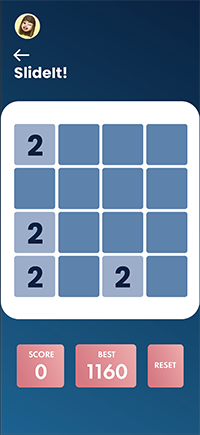

Group #1 SWIFTAF - README 
===

# Plasticity

## Table of Contents
1. [Overview](#Overview)
1. [Product Spec](#Product-Spec)
1. [Wireframes](#Wireframes)
2. [Schema](#Schema)

## Overview
### Description
iOS app that will serve to offer users multiple exercises intended to challenge finger dexterity and mental agility. There will be two games that a user
can select to play, a physical and mental game.  

### App Evaluation
[Evaluation of your app across the following attributes]
- **Category: Gaming**
- **Mobile: This app would primarily be developed for mobile devices.**
- **Story: The target audience is stroke survivors with physical and cognitive deficits.**
- **Market: Any individual can use this app but targeted to stroke survivors**
- **Habit: This app can be used whenever the user would like to use and play with**
- **Scope: There will be different levels that users can play with and depending on the performance the levels get challenging.**

## Product Spec

### 1. User Stories (Required and Optional)

**Required Must-have Stories**

- See the application logo 
- Be able to sign into Game Center if not already signed in
- See a home page screen that consists of the features 
- SlideIt game: Practice motion skills 
- Wordley game: Practice cognitive skills 
- Be able to see victory when user wins game 
- Be able to see loss when user loses game 
- Scoreboard tracker 


**Optional Nice-to-have Stories**

- To do list to keep track of daily tasks

### 2. Screen Archetypes

- Launch Screen
- Game Center Login
- Home Screen
- Wordley Game Screen
- SlideIt Game Screen
- Trophy Screen
- History/Stats Screen


### 3. Navigation

**Tab Navigation*- (Tab to Screen)

- Profile
- History, stats
- Home screen return

**Flow Navigation*- (Screen to Screen)

- Launch Screen
- Home Screen
- Select games (Wordley/SlideIt)


## Wireframes

       

## Schema 
### Models


| Property | Type    | Description                           | 
| ---------|-------  | ------------------------------------- |
| score    | Number  | number of points user recieves        |
| best     | Number  | number of high score user recieves    |
| reset    | Boolean | used to restart the game              |


### Networking

- Login Screen
  - (Create/POST) Login to Game Center
```swift
GKLocalPlayer.local.authenticateHandler = { viewController, error in
    if let viewController = viewController {
        // Present the view controller so the player can sign in.
        return
    }
    if error != nil {
        // Player could not be authenticated.
        // Disable Game Center in the game.
        return        
    }
    
    // Player was successfully authenticated.
    // Check if there are any player restrictions before starting the game.
            
    if GKLocalPlayer.local.isUnderage {
        // Hide explicit game content.
    }

    if GKLocalPlayer.local.isMultiplayerGamingRestricted {
        // Disable multiplayer game features.
    } 

    if GKLocalPlayer.local.isPersonalizedCommunicationRestricted {
        // Disable in game communication UI.
    }
    
    // Perform any other configurations as needed (for example, access point).
}
  ```

- Main Screen
  - (Read/GET) Get Current Username
```swift
let currentUser = PFUser.currentUser()
if currentUser != nil {
// Do stuff with the user
} else {
// Show the signup or login screen
}
```

- Profile screen
  - (Read/GET) Get Current User Information
```swift
var query = PFQuery(className:"User")

query.getObjectInBackgroundWithId("<PARSE_OBJECT_ID>") {
(parseObject: PFObject?, error: NSError?) -> Void in
    if error == nil && parseObject != nil {
        print(parseObject)
    } else {
        print(error)
    }
}
```
